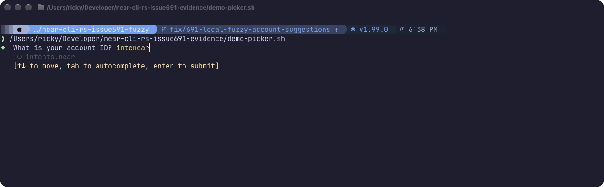
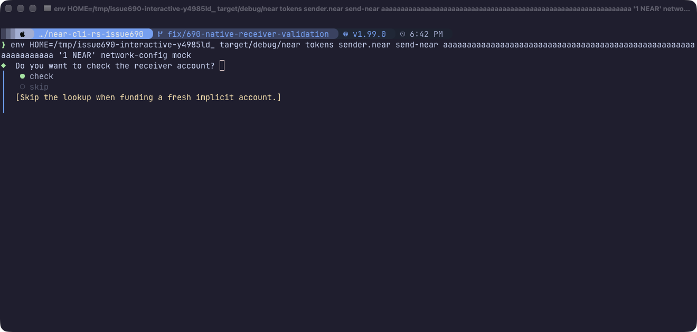
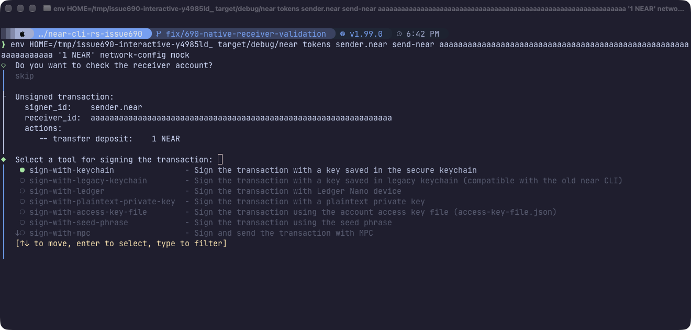
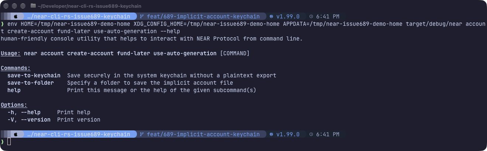
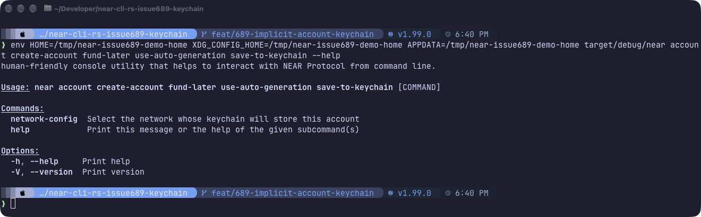

# PRs #694–#696: authentic Ghostty screenshots

These five PNGs are unedited native Cua Driver captures of a real Ghostty window on macOS. The shell is the user's existing interactive Zsh with Starship, JetBrainsMono Nerd Font Mono, and Catppuccin Mocha. No prompt or CLI output was fabricated. Source heads, binary SHA-256 hashes, image dimensions and capture identifiers are recorded in capture-manifest.json. The worktrees were clean and binary hashes were unchanged across capture. GitHub PR heads were checked before publication.

## #694 — local fuzzy account suggestions

Source: 9af09b60a1358d3977f0fe35b5e0eb6827b48339.

The safe demo launcher runs `near --offline tokens` with HOME and TMPDIR pointing to an isolated local demo home. Typed `intenear` and captured the `intents.near` suggestion; Escape cancelled without selecting an account or making RPC calls.

## #695 — optional receiver checks

Source: cbc3009dbbb2d6ae4c48252445e91c95d348e09c.

Command: `env HOME=/tmp/issue690-interactive-y4985ld_ target/debug/near tokens sender.near send-near aaaaaaaaaaaaaaaaaaaaaaaaaaaaaaaaaaaaaaaaaaaaaaaaaaaaaaaaaaaaaaaa '1 NEAR' network-config mock`.

Selected `skip`, which bypasses receiver RPC lookup, and cancelled with Escape at the signing-method menu. The local mock server remained stopped; `check` was never submitted. The displayed transaction is unsigned; nothing was signed or sent.

## #696 — direct keychain storage

Source: 353209ec57ac8b428c02fd76ef407872e143b3ca.

Both commands use `env HOME=/tmp/near-issue689-demo-home XDG_CONFIG_HOME=/tmp/near-issue689-demo-home APPDATA=/tmp/near-issue689-demo-home target/debug/near account create-account fund-later use-auto-generation`. The first ends with `--help`; the second ends with `save-to-keychain --help`.

Only help was executed. No key generation, credential write, account creation or native keychain access occurred.

All assets are isolated on a docs branch; feature code and PR bodies were not modified. Global configuration was preserved.
