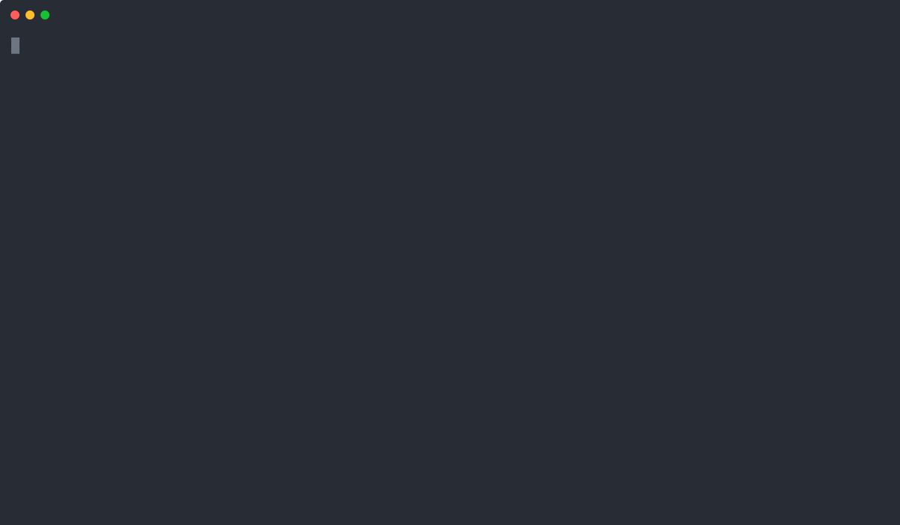

near-cli
--------

This project is still under development. Production-ready `NEAR CLI` can be found [here](https://github.com/near/near-cli).

near-cli is a command line utility for working with the Near Protocol blockchain. 

  

#### [README in English](docs/README.en.md)  
  * [Usage](docs/README.en.md#usage)
  * [User Guide](docs/README.en.md#user-guide)
  * [Installation](docs/README.en.md#installation)
  * [Building](docs/README.en.md#building)

#### [README на Русском (in Russian)](docs/README.ru.md)
  * [Применение](docs/README.ru.md#применение)
  * [Инструкция](docs/README.ru.md#инструкция)
  * [Установка](docs/README.ru.md#установка)
  * [Сборка](docs/README.ru.md#сборка)
