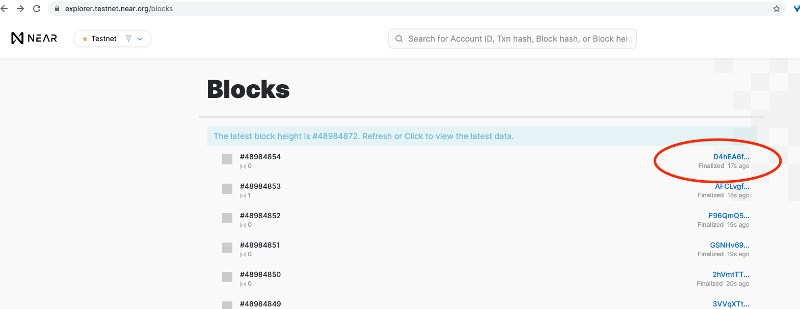
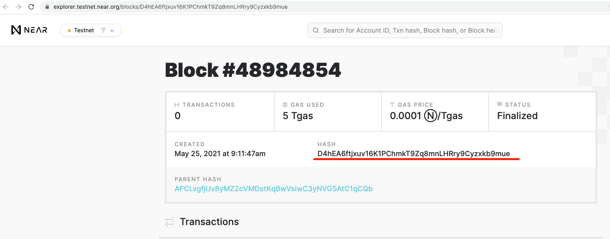

## Инструкция

Это руководство предназначено для того, чтобы дать подробное описание утилиты near-cli и
обзор её возможностей. Предполагается, что утилита near-cli
[установлена](README.ru.md#installation)
и пользователи знакомы с использованием инструментов командной строки. Также предполагается Unix-подобная система, хотя большинство команд, вероятно, легко
переводимы в любую среду оболочки командной строки.

Прежде, чем перейти к описанию конкретных команд, необходимо рассмотреть два общих для этих команд пункта:

1. Режим _Online_ / _Offline_

    Результатом работы создания любой транзакции в режиме _Offline_ (display) является подготовленная транзакция в виде Base64-закодированной строки, которую в дальнейшем можно [отправить в сеть через RPC](https://docs.near.org/docs/api/rpc#transactions). В режиме _Online_ эта возможность добавлена (send).
    Также _Online_-режим обеспечивает автоматический сбор данных, необходимых для формирования и отправки транзакции, а в режиме _Offline_ нужно будет ввести некоторые показатели вручную:

      * _transaction nonce_

        Этот номер нужно будет получить при помощи [View a nonce](#view-a-nonce), увеличив при этом на 1

      * _recent block hash_

        Информацию для этого параметра нужно искать [здесь](https://explorer.testnet.near.org/blocks) либо получить при помощи [View recent block hash](#view-recent-block-hash)

        <details><summary><i>recent block hash</i></summary>
            
            
        </details>

        <details><summary><i>Демонстрация работы Offline режима</i></summary>
        <a href="https://asciinema.org/a/HKHhY6u4mbOF1cIGDI3xbSm27?autoplay=1&t=1&speed=2">
            
        </a>
        </details>

2. Подпись транзакции

    near-cli предполагает несколько способов подписи созданной транзакции. Рассмотрим подробнее каждый.

      * _I want to sign the transaction with my private key_

        При выборе этого варианта подписи near-cli попросит пользователя ввести ключи доступа:
          "public_key":"ed25519:Ebx7...",
          "private_key":"ed25519:2qM8..."

      * _I want to sign the transaction with keychain_
        
        В зависимости от выбранного режима сети _Online_ / _Offline_ near-cli самостоятельно найдет ключи доступа и подпишет созданную транзакцию.  
        Для режима _Offline_ ключи доступа должны находиться в файле *имя_пользователя.json*, расположенном в */Users/user/.near-credentials/default/*.  
        Например, */Users/frovolod/.near-credentials/default/volodymyr.testnet.json*.  
        Для режима _Online_ ключи доступа должны находиться в файле *публичный_ключ.json*, расположенном в */Users/user/.near-credentials/имя_сети/имя_пользователя/*.  
        Например, */Users/frovolod/.near-credentials/testnet/volodymyr.testnet/ed25519_8h7kFK4quSUJRkUwo3LLiK83sraEm2jnQTECuZhWu8HC.json*

      * _I want to sign the transaction with Ledger device_
        
        Этот вариант предполагает подписание созданной транзакции при помощи леджера.

        <details><summary><i>Демонстрация работы команды в интерактивном режиме</i></summary>
        <a href="https://asciinema.org/a/7WyNHxSCKY1v6uOa5INPvXW9x?autoplay=1&t=1&speed=2">
            
        </a>
        </details>

      * _I want to construct the transaction and sign it somewhere else_
        
        Этот вариант предполагает подписание созданной транзакции сторонним программным продуктом.

### Группы команд

* [View account, contract code, contract state, transaction, nonce](#view-account-contract-code-contract-state-transaction-nonce)
* [Transfer tokens](#transfer-tokens)
* [Execute function (contract method)](#execute-function-contract-method)
* [Add access key, contract code, stake proposal, sub-account, implicit-account](#add-access-key-contract-code-stake-proposal-sub-account-implicit-account)
* [Delete access key, account](#delete-access-key-account)
* [Construct a new transaction](#construct-a-new-transaction)
* [Helpers](#helpers)


### View account, contract code, contract state, transaction, nonce

Просмотреть сведения об аккаунте ([View properties for an account](#view-properties-for-an-account)), скачать код контракта ([View a contract code](#view-a-contract-code)) и просмотреть состояние контракта ([View a contract state](#view-a-contract-state)) возможно в режиме реального времени (__at-final-block__) и режиме архивных данных (__at-block-height__, __at-block-hash__). На примерах ниже показаны варианты применения этих режимов.

#### View properties for an account

##### at-final-block

Для просмотра сведений об аккаунте необходимо ввести в командной строке терминала:
```txt
./near-cli view account-summary \
        network testnet \
        account 'volodymyr.testnet' \
        at-final-block
```

<details><summary><i>Результат выполнения команды</i></summary>

```txt
Account details for 'volodymyr.testnet' at block #49787790 (33RYuu9YoLDVCidWig8uKtuSb7jr3NmcJDzVeeKmSkiW)
Native account balance: 256.718 NEAR
Validator stake: 0 NEAR
Storage used by the account: 115385 bytes
Contract code SHA-256 checksum (hex): 4de7df8ee6ff3780cfed298ceafde26e7477041ca8e2af7ae8c749de7068c0f2
Number of access keys: 7
   1. ed25519:2KZwhWEM5hbtP28kpx9TER3zyz9rL3Az1fcHsgr2Fzd1 (nonce: 9) is granted to full access
   2. ed25519:36u45LFDfgKQYr8ApgBi1kUHN5FpkTQRqvt66cwEdqiK (nonce: 0) is granted to full access
   3. ed25519:7FmDRADa1v4BcLiiR9MPPdmWQp3Um1iPdAYATvBY1YzS (nonce: 168) is granted to full access
   4. ed25519:8b6ghV9BLNNB7RwaxSxjbH636bfM9m6NL7bmLBSXPqK8 (nonce: 2) is granted to full access
   5. ed25519:937VyVwszEH13quNuPM4nNQTrDssNzRNnLMjPbN92tgu (nonce: 3) is granted to full access
   6. ed25519:ApWodksvd7grTjFFimCroLxvrVDi7WD6g6gDE7RuhoGH (nonce: 1) is granted to full access
   7. ed25519:JC5R9H6wjthHeumnUePRjvJNJrRm6ZTFUoi1NYuj9DBZ (nonce: 0) is granted to full access
```
</details>

<details><summary><i>Демонстрация работы команды в интерактивном режиме</i></summary>
<a href="https://asciinema.org/a/8sdSrqPbi1TVaoZgQ5luKJgod?autoplay=1&t=1&speed=2">
    
</a>
</details>

##### at-block-height

Для просмотра сведений об аккаунте необходимо ввести в командной строке терминала:
```txt
./near-cli view account-summary \
        network testnet \
        account 'volodymyr.testnet' \
        at-block-height 42775277
```

<details><summary><i>Результат выполнения команды</i></summary>

```txt
Account details for 'volodymyr.testnet' at block #42775277 (FrMNHB5y2fZZVfgC6VgfykSRWoTViT2KeWGhgkXKgtTe)
Native account balance: 377.874 NEAR
Validator stake: 0 NEAR
Storage used by the account: 592 bytes
Contract code is not deployed to this account.
Number of access keys: 6
   1. ed25519:36u45LFDfgKQYr8ApgBi1kUHN5FpkTQRqvt66cwEdqiK (nonce: 0) is granted to full access
   2. ed25519:7FmDRADa1v4BcLiiR9MPPdmWQp3Um1iPdAYATvBY1YzS (nonce: 111) is granted to full access
   3. ed25519:8b6ghV9BLNNB7RwaxSxjbH636bfM9m6NL7bmLBSXPqK8 (nonce: 1) is granted to full access
   4. ed25519:937VyVwszEH13quNuPM4nNQTrDssNzRNnLMjPbN92tgu (nonce: 3) is granted to full access
   5. ed25519:ApWodksvd7grTjFFimCroLxvrVDi7WD6g6gDE7RuhoGH (nonce: 1) is granted to full access
   6. ed25519:JC5R9H6wjthHeumnUePRjvJNJrRm6ZTFUoi1NYuj9DBZ (nonce: 0) is granted to full access
```
</details>

<details><summary><i>Демонстрация работы команды в интерактивном режиме</i></summary>
</details>

##### at-block-hash

Для просмотра сведений об аккаунте необходимо ввести в командной строке терминала:
```txt
./near-cli view account-summary \
        network testnet \
        account 'volodymyr.testnet' \
        at-block-hash BWUZMBHPnsQR1u69keUZcYKpsjREqtGFNNGkXq74c8JN
```

<details><summary><i>Результат выполнения команды</i></summary>

```txt
Account details for 'volodymyr.testnet' at block #42466273 (BWUZMBHPnsQR1u69keUZcYKpsjREqtGFNNGkXq74c8JN)
Native account balance: 377.874 NEAR
Validator stake: 0 NEAR
Storage used by the account: 592 bytes
Contract code is not deployed to this account.
Number of access keys: 6
   1. ed25519:36u45LFDfgKQYr8ApgBi1kUHN5FpkTQRqvt66cwEdqiK (nonce: 0) is granted to full access
   2. ed25519:7FmDRADa1v4BcLiiR9MPPdmWQp3Um1iPdAYATvBY1YzS (nonce: 111) is granted to full access
   3. ed25519:8b6ghV9BLNNB7RwaxSxjbH636bfM9m6NL7bmLBSXPqK8 (nonce: 1) is granted to full access
   4. ed25519:937VyVwszEH13quNuPM4nNQTrDssNzRNnLMjPbN92tgu (nonce: 3) is granted to full access
   5. ed25519:ApWodksvd7grTjFFimCroLxvrVDi7WD6g6gDE7RuhoGH (nonce: 1) is granted to full access
   6. ed25519:JC5R9H6wjthHeumnUePRjvJNJrRm6ZTFUoi1NYuj9DBZ (nonce: 0) is granted to full access
```
</details>

<details><summary><i>Демонстрация работы команды в интерактивном режиме</i></summary>
</details>

#### View a contract code

Режимами реального времени (__at-final-block__) и  архивных данных (__at-block-height__, __at-block-hash__) следует пользоваться аналогично просмотру сведений об аккаунте ([View properties for an account](#view-properties-for-an-account)).

  * Для получения файла контракта необходимо ввести в командной строке терминала:

    ```txt
    ./near-cli view contract-code \
            network testnet \
            contract 'volodymyr.testnet' \
            download './contract-volodymyr.testnet.wasm' \
            at-final-block
    ```

    <details><summary><i>Результат выполнения команды</i></summary>
    
    ```txt
    The file "contract-volodymyr.testnet.wasm" was downloaded successfully
    ```
    </details>

    <details><summary><i>Демонстрация работы команды в интерактивном режиме</i></summary>
    <a href="https://asciinema.org/a/4sJOszIaaH3zfGzpWAlR9Gxpk?autoplay=1&t=1&speed=2">
        
    </a>
    </details>

  * Для получения хэша контракта необходимо ввести в командной строке терминала:

    ```txt
    ./near-cli view contract-code \
            network testnet \
            contract 'volodymyr.testnet' \
            hash \
            at-final-block
    ```
    
    <details><summary><i>Результат выполнения команды</i></summary>

    ```txt
    Hash of the contract: 6F7TqH3ggf4iKbmJpFg9uJq87HTUohP1rdrDU7tZx9iH
    ```
    </details>

    <details><summary><i>Демонстрация работы команды в интерактивном режиме</i></summary>
    <a href="https://asciinema.org/a/JQPVxVliUflaVqUeyfOShXqqQ?autoplay=1&t=1&speed=2">
        
    </a>
    </details>

#### View a contract state

Режимами реального времени (__at-final-block__) и  архивных данных (__at-block-height__, __at-block-hash__) следует пользоваться аналогично просмотру сведений об аккаунте ([View properties for an account](#view-properties-for-an-account)).  

Для просмотра состояния контракта необходимо ввести в командной строке терминала:
```txt
./near-cli view contract-state \
        network testnet \
        account 'volodymyr.testnet' \
        at-final-block
```

<details><summary><i>Результат выполнения команды</i></summary>

```txt
Contract state (values):
[
    StateItem {
        key: "U1RBVEU=",
        value: "BA==",
        proof: [],
    },
]


Contract state (proof):
[]
```
</details>

<details><summary><i>Демонстрация работы команды в интерактивном режиме</i></summary>
<a href="https://asciinema.org/a/P1jqzFGpF9qjm5XbKA1yr8RqZ?autoplay=1&t=1&speed=2">
    
</a>
</details>

#### View a transaction status

Для просмотра статуса желаемой транзакции необходимо ввести в командной строке терминала её хэш:
```txt
./near-cli view transaction \
        network testnet \
        transaction-hash 'GDoinMecpvnqahzJz9tXLxYycznL4cAoxKTPEnJZ3ank' \
        signer 'volodymyr.testnet'
```

<details><summary><i>Результат выполнения команды</i></summary>

```txt
Specify the account that signed the transaction: volodymyr.testnet
Transactiion status: FinalExecutionOutcome {
    status: SuccessValue(``),
    transaction: SignedTransactionView {
        signer_id: "volodymyr.testnet",
        public_key: ed25519:7FmDRADa1v4BcLiiR9MPPdmWQp3Um1iPdAYATvBY1YzS,
        nonce: 165,
        receiver_id: "qweqweqwe.volodymyr.testnet",
        actions: [
            CreateAccount,
            Transfer {
                deposit: 100000000000000000000000000,
            },
            AddKey {
                public_key: ed25519:AgVv8qjZ7yix3pTo7BimT1zoDYUSTGcg73RBssC5JMRf,
                access_key: AccessKeyView {
                    nonce: 0,
                    permission: FullAccess,
                },
            },
        ],
        signature: ed25519:266jBRjvnaxe4mDyHRGwv3TJesvgRo2umJBqkZU26fRwmhVHciu3tBSLqRZFjEuqLTiwDTrFvfxpJ8Sbd2PqHHhv,
        hash: `GDoinMecpvnqahzJz9tXLxYycznL4cAoxKTPEnJZ3ank`,
    },
    transaction_outcome: ExecutionOutcomeWithIdView {
        proof: [],
        block_hash: `AQH6jDqqxpBYj5NSZv3Skg5hUZQRsn16jvDuphCTugSQ`,
        id: `GDoinMecpvnqahzJz9tXLxYycznL4cAoxKTPEnJZ3ank`,
        outcome: ExecutionOutcomeView {
            logs: [],
            receipt_ids: [
                `5DmuFwQaiSbEDiR7dx6sDurjyDyF92c1tK7gfN7bXqPh`,
            ],
            gas_burnt: 424555062500,
            tokens_burnt: 42455506250000000000,
            executor_id: "volodymyr.testnet",
            status: SuccessReceiptId(5DmuFwQaiSbEDiR7dx6sDurjyDyF92c1tK7gfN7bXqPh),
        },
    },
    receipts_outcome: [
        ExecutionOutcomeWithIdView {
            proof: [],
            block_hash: `DBUpiLVVDBQwSAPU8ZTE8KQnX5skDD1dTsBjJQ8kV24R`,
            id: `5DmuFwQaiSbEDiR7dx6sDurjyDyF92c1tK7gfN7bXqPh`,
            outcome: ExecutionOutcomeView {
                logs: [],
                receipt_ids: [
                    `851GMnZZ5FJ2aDSHM34N99yVb1ZkwY8n7F8rUcvuRpUU`,
                ],
                gas_burnt: 424555062500,
                tokens_burnt: 42455506250000000000,
                executor_id: "qweqweqwe.volodymyr.testnet",
                status: SuccessValue(``),
            },
        },
        ExecutionOutcomeWithIdView {
            proof: [],
            block_hash: `BSjrH3WyKnXhD17drR94YfM725Ho59us9N4msXrrgHEw`,
            id: `851GMnZZ5FJ2aDSHM34N99yVb1ZkwY8n7F8rUcvuRpUU`,
            outcome: ExecutionOutcomeView {
                logs: [],
                receipt_ids: [],
                gas_burnt: 0,
                tokens_burnt: 0,
                executor_id: "volodymyr.testnet",
                status: SuccessValue(``),
            },
        },
    ],
}
```
</details>

<details><summary><i>Демонстрация работы команды в интерактивном режиме</i></summary>
<a href="https://asciinema.org/a/HYNfgJ5Gze7fFKntubz7TW6r6?autoplay=1&t=1&speed=2">
    
</a>
</details>

#### View a nonce

Для просмотра _nonce_ желаемого публичного ключа доступа необходимо ввести в командной строке терминала:
```txt
./near-cli view nonce \
        network testnet \
        account 'volodymyr.testnet' \
        public-key 'ed25519:7FmDRADa1v4BcLiiR9MPPdmWQp3Um1iPdAYATvBY1YzS'
```

<details><summary><i>Результат выполнения команды</i></summary>

```txt
current nonce: 168  for a public key: ed25519:7FmDRADa1v4BcLiiR9MPPdmWQp3Um1iPdAYATvBY1YzS
```
</details>

<details><summary><i>Демонстрация работы команды в интерактивном режиме</i></summary>
<a href="https://asciinema.org/a/g2WZpFu6njjxoklP4J7Ibc5Q6?autoplay=1&t=1&speed=2">
    
</a>
</details>

#### View recent block hash

Для просмотра _recent block hash_ выбранной сети необходимо ввести в командной строке терминала:
```txt
./near-cli view recent-block-hash \
        network testnet
```

<details><summary><i>Результат выполнения команды</i></summary>

```txt
recent block hash: `CDgRvkv2qv2c8e5m2WDKFUFqAtXrq2fiUteM6XHpy58t`
```
</details>

<details><summary><i>Демонстрация работы команды в интерактивном режиме</i></summary>
<a href="https://asciinema.org/a/vF2X1zKIMg2rdByGCKHDIYDKa?autoplay=1&t=1&speed=2">
    
</a>
</details>


### Transfer tokens

Данная команда служит для перевода средств между аккаунтами. Обратите внимание, что количество пересылаемых токенов указывается совместно с размерной единицей (это NEAR либо yoctoNEAR).
Для выполнения этой команды необходимо ввести в командной строке терминала:
```txt
./near-cli transfer near \
        network testnet \
        sender 'volodymyr.testnet' \
        receiver '21.volodymyr.testnet' \
        amount  '1 NEAR' \
        sign-with-keychain \
        send
```

<details><summary><i>Результат выполнения команды</i></summary>

```txt
Transaction sent ...
Successful transaction
<volodymyr.testnet> has transferred 1.000 NEAR to <21.volodymyr.testnet> successfully.
Transaction ID: EiRJ7JCCX7qi9wc9KETnco2n81afU1xbsjyJCuH5SWcX.
To see the transaction in the transaction explorer, please open this url in your browser:
https://explorer.testnet.near.org/transactions/EiRJ7JCCX7qi9wc9KETnco2n81afU1xbsjyJCuH5SWcX
```
</details>

<details><summary><i>Демонстрация работы команды в интерактивном режиме</i></summary>
<a href="https://asciinema.org/a/NjCuGbC6IDyz5VsrXZrgrSF17?autoplay=1&t=1&speed=2">
    
</a>
</details>


### Execute function (contract method)

#### Change a method

Для выполнения этой команды необходимо ввести в командной строке терминала:
```txt
./near-cli execute change-method \
        network testnet \
        contract 'meta.pool.testnet' \
        call 'distribute_staking' '{}' \
            --attached-deposit '0 NEAR' \
            --prepaid-gas '3 Tgas' \
        signer 'volodymyr.testnet' \
        sign-with-keychain \
        send
```

<details><summary><i>Результат выполнения команды</i></summary>

```txt
Transaction sent ...
Successful transaction
The "distribute_staking" call to <meta.pool.testnet> on behalf of <volodymyr.testnet> succeeded.
Transaction ID: 7TpFFVBs9CXYoRpRtZqMuLAWnGbgx3qyRy9jhawv8HqX.
To see the transaction in the transaction explorer, please open this url in your browser:
https://explorer.testnet.near.org/transactions/7TpFFVBs9CXYoRpRtZqMuLAWnGbgx3qyRy9jhawv8HqX
```
</details>

<details><summary><i>Демонстрация работы команды в интерактивном режиме</i></summary>
<a href="https://asciinema.org/a/wyk4o4FltmUD00tmToCSoH24l?autoplay=1&t=1&speed=2">
    
</a>
</details>

#### View a method

Режимами реального времени (__at-final-block__) и  архивных данных (__at-block-height__, __at-block-hash__) следует пользоваться аналогично просмотру сведений об аккаунте ([View properties for an account](#view-properties-for-an-account)).  

Для выполнения этой команды необходимо ввести в командной строке терминала:
```txt
./near-cli execute view-method \
        network mainnet \
        contract zavodil.poolv1.near \
        call 'get_accounts' '{"from_index": 0, "limit": 3}' \
        at-final-block
```

<details><summary><i>Результат выполнения команды</i></summary>

```txt
[
  {
    "account_id": "zavodil.near",
    "unstaked_balance": "8",
    "staked_balance": "11662078846731298726428263471",
    "can_withdraw": true
  },
  {
    "account_id": "gagdiez.near",
    "unstaked_balance": "4",
    "staked_balance": "2195619736137302553610087167",
    "can_withdraw": true
  },
  {
    "account_id": "5ff98e7c85755e0f77c78eaf4a8aeca24846d8b5.lockup.near",
    "unstaked_balance": "1300000000000000000000000001",
    "staked_balance": "10759346016497580677112779659",
    "can_withdraw": false
  }
]
```
</details>

<details><summary><i>Демонстрация работы команды в интерактивном режиме</i></summary>
<a href="https://asciinema.org/a/0v0TBnInhHeXv3N85dRmyXEZM?autoplay=1&t=1&speed=2">
    
</a>
</details>


### Add access key, contract code, stake proposal, sub-account, implicit-account

#### Add a new access key for an account

Выполним команду добавления новой пары ключей доступа аккаунту с такими условиями:
  * публичный ключ доступа будет введен вручную
  * ключи будут иметь полный доступ
  * транзакция будет подписана автоматически (при наличии файла с ключами доступа)

Для выполнения этой команды необходимо ввести в командной строке терминала:
```txt
./near-cli add access-key \
        network testnet \
        account 'volodymyr.testnet' \
        public-key 'ed25519:61WaaKFEXTvhk35xmyScVE9yHc5DareBvomLYbCYteb' \
        grant-full-access \
        sign-with-keychain \
        send
```

<details><summary><i>Результат выполнения команды</i></summary>

```txt
Transaction sent ...
Successful transaction
Added access key = ed25519:61WaaKFEXTvhk35xmyScVE9yHc5DareBvomLYbCYteb to volodymyr.testnet.
Transaction ID: 59LEJEQT7jVMXdVi3ab4y8nbQ7uFJ8wRny9tD3qkv5Ez.
To see the transaction in the transaction explorer, please open this url in your browser:
https://explorer.testnet.near.org/transactions/59LEJEQT7jVMXdVi3ab4y8nbQ7uFJ8wRny9tD3qkv5Ez
```
</details>

<details><summary><i>Демонстрация работы команды в интерактивном режиме</i></summary>
<a href="https://asciinema.org/a/bXhJzaCUNf3FHih268NJZ8Fit?autoplay=1&t=1&speed=2">
    
</a>
</details>

Изменим наши парамерты для добавления кючей доступа:
  * ключи будут сгенерированы автоматически
  * будут иметь функциональный доступ
  * транзакция будет подписана вручную

Для этого введем следующую команду:
```txt
./near-cli add access-key \
        network testnet \
        account '21.volodymyr.testnet' \
        generate-keypair \
        grant-function-call-access \ 
            --receiver-id 'meta.pool.testnet' \
            --allowance '10 NEAR' \
            --method-names 'set_a, set_b' \
        sign-private-key \
            --signer-public-key ed25519:Ebx7NiwqupsshnUsEZCzgm84SQqi8LZWJx7ermrr14JF \
            --signer-secret-key  ed25519:2qM8v3nF4opam1frweMmD5h4PM3H6jtxfuAE77rpEuUx2rSGj64AzDf9xPKG76bgAs5L1oecV93etPy6xKjds2YB \
        send

```

<details><summary><i>Результат выполнения команды</i></summary>

```txt
Transaction sent ...
Successful transaction
Added access key = ed25519:H8pzJt6RHCtVL7THc2AW5KwTXUtVhDCRocHqapfH5L47 to 21.volodymyr.testnet.
Transaction ID: 92y4UzovU4vgfKRVBmLR15M6mYPGp1y2za6HKXXsjF1H.
To see the transaction in the transaction explorer, please open this url in your browser:
https://explorer.testnet.near.org/transactions/92y4UzovU4vgfKRVBmLR15M6mYPGp1y2za6HKXXsjF1H
```
</details>

<details><summary><i>Демонстрация работы команды в интерактивном режиме</i></summary>
<a href="https://asciinema.org/a/DOOZ2yQfUUzuRUY1S3LaktHRm?autoplay=1&t=1&speed=2">
    
</a>
</details>

#### Add a new contract code

Для добавления нового контракта необходимо ввести в командной строке терминала:
```txt
./near-cli add contract-code \
        network testnet \
        account 'volodymyr.testnet' \
        contract-file '/Users/frovolod/Documents/NEAR/rust-counter/contract/target/wasm32-unknown-unknown/release/rust_counter_tutorial.wasm' \
        initialize 'increment' '{}'     \
            --attached-deposit '0 NEAR' \
            --prepaid-gas '1 TGas' \
        sign-with-keychain \
        send
```

<details><summary><i>Результат выполнения команды</i></summary>

```txt
Transaction sent ...
Successful transaction
Contract code has been successfully deployed.
The "increment" call to <volodymyr.testnet> on behalf of <volodymyr.testnet> succeeded.
Transaction ID: AhJ2fRAu6ocn3RDaKaCtofzfhr5C1z4wXEZDbrhewm4.
To see the transaction in the transaction explorer, please open this url in your browser:
https://explorer.testnet.near.org/transactions/AhJ2fRAu6ocn3RDaKaCtofzfhr5C1z4wXEZDbrhewm4
```
</details>

<details><summary><i>Демонстрация работы команды в интерактивном режиме</i></summary>
<a href="https://asciinema.org/a/wO3YVUR8GOh5KoYjpSWxGwlQB?autoplay=1&t=1&speed=2">
    
</a>
</details>

#### Add an implicit-account

Данная команда автоматически генерирует ключи доступа и сохраняет их в файле.
Для выполнения этой команды необходимо ввести в командной строке терминала:
```txt
./near-cli add implicit-account \
        generate-keypair
```

<details><summary><i>Результат выполнения команды</i></summary>

```txt
The data for the access key is saved in a file /Users/frovolod/.near-credentials/default/cbb8d84ac58503f2a53e07830008531a8480b8dd42db045316cd89c87d2b4862.json
```
</details>

<details><summary><i>Демонстрация работы команды в интерактивном режиме</i></summary>
<a href="https://asciinema.org/a/Ub5Q13ZEKfzG4I0yKd0zinFjr?autoplay=1&t=1&speed=2">
    
</a>
</details>

#### Add a new stake proposal

Сделать ставку можно с помощью этой команды:
```txt
./near-cli add stake-proposal \
        network testnet \
        validator 'volodymyr.testnet' \
        amount '100 NEAR' \
        transactions-signing-public-key 'ed25519:7ctWiPKSxdvPmAbwCBDT7dBCcJ5iqP14ohwVr7vf4whJ' \
        sign-with-keychain \
        send
```

<details><summary><i>Результат выполнения команды</i></summary>

```txt
Transaction sent ...
Failed transaction
Error: Insufficient stake 100.000 NEAR.
The minimum rate must be 31097.761 NEAR.
Transaction ID: 8m2NphgJfvY4u4kWt7ntaZmXt6CrqXuq44VVZoDMUATo.
To see the transaction in the transaction explorer, please open this url in your browser:
https://explorer.testnet.near.org/transactions/8m2NphgJfvY4u4kWt7ntaZmXt6CrqXuq44VVZoDMUATo
```
</details>

<details><summary><i>Демонстрация работы команды в интерактивном режиме</i></summary>
<a href="https://asciinema.org/a/nMovygVG9GyKSVU0ywtk5z0RT?autoplay=1&t=1&speed=2">
    
</a>
</details>

#### Add a new sub-account

Для создания суб-аккаунта необходимо ввести в командной строке терминала:
```txt
./near-cli add sub-account \
        network testnet \
        owner-account 'volodymyr.testnet' \
        sub-account '282.volodymyr.testnet' \
        sub-account-full-access \
        generate-keypair \
        deposit '1 NEAR' \
        sign-with-keychain \
        send
```

<details><summary><i>Результат выполнения команды</i></summary>

```txt
Transaction sent ...
Successful transaction
New account <282.volodymyr.testnet> has been successfully created.
Added access key = ed25519:512RGPTghPXSNziZRUi9K7UzMHiAwEetL5FpmZw6zdHd to 282.volodymyr.testnet.
<volodymyr.testnet> has transferred 1.000 NEAR to <282.volodymyr.testnet> successfully.
Transaction ID: 24a5rxkH4gLus4YBqm47JRNygbZEKLgiJVCZFx3Hcjqp.
To see the transaction in the transaction explorer, please open this url in your browser:
https://explorer.testnet.near.org/transactions/24a5rxkH4gLus4YBqm47JRNygbZEKLgiJVCZFx3Hcjqp
```
</details>

<details><summary><i>Демонстрация работы команды в интерактивном режиме</i></summary>
<a href="https://asciinema.org/a/nW78yyzNhkK09sAxSFTgk0zX8?autoplay=1&t=1&speed=2">
    
</a>
</details>


### Delete access key, account

#### Delete an access key for this account

Для удаления ключей доступа необходимо ввести в командной строке терминала:
```txt
./near-cli delete access-key \
        network testnet \
        account 'volodymyr.testnet' \
        public-key 'ed25519:Ekgny2BNdwaoRuNW2JBkSv6FGDjmrd5iP8noXE4dTUk2' \
        sign-with-keychain \
        send
```

<details><summary><i>Результат выполнения команды</i></summary>

```txt
Transaction sent ...
Successful transaction
Access key <ed25519:Ekgny2BNdwaoRuNW2JBkSv6FGDjmrd5iP8noXE4dTUk2> for account <volodymyr.testnet> has been successfully deletted.
Transaction ID: 9xeBgqpRButrSGZNUGcYbsxs2JM3A9NoH7Bkh6op4K8D.
To see the transaction in the transaction explorer, please open this url in your browser:
https://explorer.testnet.near.org/transactions/9xeBgqpRButrSGZNUGcYbsxs2JM3A9NoH7Bkh6op4K8D
```
</details>

<details><summary><i>Демонстрация работы команды в интерактивном режиме</i></summary>
<a href="https://asciinema.org/a/KSZkGbwnQbG5vGtlG2fGIrawm?autoplay=1&t=1&speed=2">
    
</a>
</details>

#### Delete this account

Данная команда предназначена для удаления текущего аккаунта. Важно помнить, что все средства удаляемого аккаунта перейдут на счет "_beneficiary_".
Для выполнения этой команды необходимо ввести в командной строке терминала:
```txt
./near-cli delete account \
        network testnet \
        account '282.volodymyr.testnet' \
        beneficiary 'volodymyr.testnet' \
        sign-with-keychain \
        send
```

<details><summary><i>Результат выполнения команды</i></summary>

```txt
Transaction sent ...
Successful transaction
Account <282.volodymyr.testnet> has been successfully deletted.
Transaction ID: CfRvfMvEY7vtKM2ub18nKsMivNo95wUC5VYYQ64gcPm.
To see the transaction in the transaction explorer, please open this url in your browser:
https://explorer.testnet.near.org/transactions/CfRvfMvEY7vtKM2ub18nKsMivNo95wUC5VYYQ64gcPm
```
</details>

<details><summary><i>Демонстрация работы команды в интерактивном режиме</i></summary>
<a href="https://asciinema.org/a/XEwJ4NVkuG7mnDiADiNPQ2L7n?autoplay=1&t=1&speed=2">
    
</a>
</details>


### Construct a new transaction

Рассмотрим пример, когда необходимо выполнить несколько действий в рамках одной транзакции:
1. Создать аккаунт
2. Добавить созданному аккаунту ключи доступа
3. Осуществить перевод токенов на созданный аккаунт

Для этого воспользуемся конструктором транзакции:

<details><summary>Construct a new transaction (демонстрация работы команды)</summary>
<a href="https://asciinema.org/a/2HPsb14qsgkr05eesfzXAKTXb?autoplay=1&t=1&speed=2">
    
</a>
</details>


### Helpers

#### Generate a key pair

Данная утилита генерирует случайным образом ключи доступа. 
<details><summary><i>Демонстрация работы команды в интерактивном режиме</i></summary>
<a href="https://asciinema.org/a/vwlWvmyNnxaGOFMeHb5wkwe2t?autoplay=1&t=1&speed=2">
    
</a>
</details>

#### Sign a transaction with secret key

Данныя утилита позволяет подписать своими ключами ранее сформированную и неподписанную транзакцию.
<details><summary><i>Демонстрация работы команды в интерактивном режиме</i></summary>
<a href="https://asciinema.org/a/sjS78AfPfwltNge2Yb9uRCxSX?autoplay=1&t=1&speed=2">
    
</a>
</details>

#### Sign a transaction with Ledger

Данныя утилита позволяет подписать ранее сформированную и неподписанную транзакцию при помощи леджера. Предполагается, что леджер подключен к компьютеру, 
разблокирован и на нем запущено приложение _NEAR_.
<details><summary><i>Демонстрация работы команды в интерактивном режиме</i></summary>
<a href="https://asciinema.org/a/G96fR2Ap9qdImtn2ITUJL82RR?autoplay=1&t=1&speed=2">
    
</a>
</details>

#### Combine unsigned transaction with signature

Данныя утилита позволяет подписать своей подписью (signature) ранее сформированную и неподписанную транзакцию.
<details><summary><i>Демонстрация работы команды в интерактивном режиме</i></summary>
<a href="https://asciinema.org/a/HfsutLZKnWS8w1PnY1kGIUYid?autoplay=1&t=1&speed=2">
    
</a>
</details>

#### Deserializing the bytes from base64

Данная утилита позволяет закодированную в Base64 транзакцию (подписанную или неподписанную) представить в удобочитаемом формате.
<details><summary><i>Демонстрация работы команды в интерактивном режиме</i></summary>
<a href="https://asciinema.org/a/Gtb4M13a8QW5VaVmfgBLEcq3X?autoplay=1&t=1&speed=2">
    
</a>
</details>

#### Send signed transaction

Данная утилита позволяет закодированную в Base64 подписанную транзакцию отправить в обработку.
<details><summary><i>Демонстрация работы команды в интерактивном режиме</i></summary>
<a href="https://asciinema.org/a/4g9yN7PFBdBSeQRxPc8ydfpWs?autoplay=1&t=1&speed=2">
    
</a>
</details>
