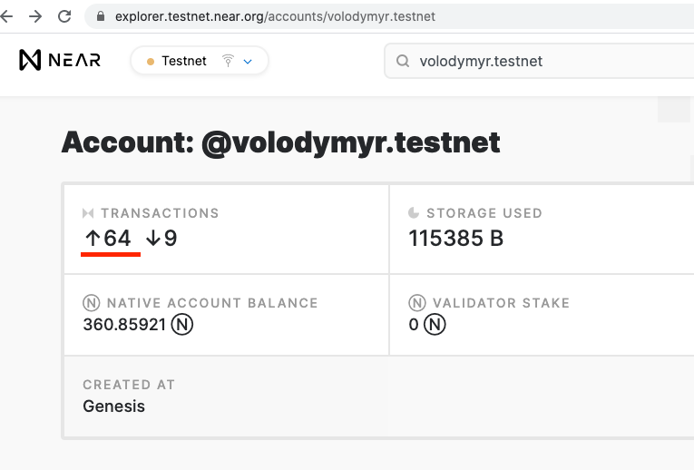

## Инструкция

Это руководство предназначено для того, чтобы дать подробное описание утилиты near-cli и
обзор её возможностей. Предполагается, что утилита near-cli
[установлена](README.ru.md#installation)
и пользователи знакомы с использованием инструментов командной строки. Также предполагается Unix-подобная система, хотя большинство команд, вероятно, легко
переводимы в любую среду оболочки командной строки.

Прежде, чем перейти к описанию конкретных команд, необходимо рассмотреть два общих для этих команд пункта:

1. Режим _Online_ / _Offline_

    Результатом работы создания любой транзакции в режиме _Offline_ (display) является подготовленная транзакция в виде Base64-закодированной строки, которую вдальнейшем можно [отправить в сеть через RPC](https://docs.near.org/docs/api/rpc#transactions). В режиме _Online_ эта возможность добавлена (send).
    Также _Online_-режим обеспечивает автоматический сбор данных, необходимых для формирования и отправки транзакции, а в режиме _Offline_ нужно будет ввести некоторые показатели вручную:

      * _transaction nonce_

        Этот номер нужно будет найти на сайте своей учетной записи ([например](media/transaction_nonce.png)), увеличив при этом на 1

    <details><summary><i>transaction nonce</i></summary>
        
    </details>

      * _recent block hash_

        Информацию для этого параметра нужно искать [здесь](https://explorer.testnet.near.org/blocks).

    <details><summary><i>recent block hash</i></summary>
        
        
    </details>

    <details><summary><i>Демонстрация работы Offline режима</i></summary>
    <a href="https://asciinema.org/a/REcIXg1yQqLpz42EzNQt8B99f?autoplay=1&t=1&speed=2">
        
    </a>
    </details>

2. Подпись транзакции

    near-cli предполагает несколько способов подписи созданной транзакции. Рассмотрим подробнее каждый.

      * _I want to sign the transaction with my private key_

        При выборе этого варианта подписи near-cli попросит пользователя ввести ключи доступа:
          "public_key":"ed25519:Ebx7...",
          "private_key":"ed25519:2qM8..."

      * _I want to sign the transaction with keychain_
        
        При выборе этого варианта подписи near-cli самостоятельно найдет ключи доступа в файле *имя_пользователя.json*, расположенного в */Users/user/.near-credentials/default/*.
        Например, */Users/frovolod/.near-credentials/default/volodymyr.testnet.json*.

      * _I want to construct the transaction and sign it somewhere else_
        
        Этот вариант предполагает подписание созданной транзакции сторонним программным продуктом.


### Группы команд

* [Add access key, contract code, stake proposal, sub-account, implicit-account](#add-access-key-contract-code-stake-proposal-sub-account-implicit-account)
* [Construct a new transaction](#construct-a-new-transaction)
* [Delete access key, account](#delete-access-key-account)
* [Execute function (contract method)](#execute-function-contract-method)
* [Transfer tokens](#transfer-tokens)
* [Helpers](#helpers)
* [View account, contract code, contract state, transaction](#view-account-contract-code-contract-state-transaction)


### Add access key, contract code, stake proposal, sub-account, implicit-account

#### Add a new access key for an account

Выполним команду с такими условиями:
  * публичный ключ доступа будет введен вручную
  * ключи будут иметь полный доступ

Для выполнения этой команды в командной строке терминала необходимо ввести:
```txt
./near-cli add access-key \
        network testnet \
        account 'volodymyr.testnet' \
        public-key 'ed25519:Ebx7...' \
        grant-full-access \
        sign-with-keychain \
        send
```
Результат выполнения команды:
```txt
========= SENT =========


---  Signed transaction:   ---
    SignedTransaction {
    transaction: Transaction {
        signer_id: "volodymyr.testnet",
        public_key: ed25519:7FmD...,
        nonce: 149,
        receiver_id: "volodymyr.testnet",
        block_hash: `Am5ZGCMSeEyY4BJqqwMBKA9AV8uB77m5Yn52P4rbEFu6`,
        actions: [
            AddKey(
                AddKeyAction {
                    public_key: ed25519:Ebx7...,
                    access_key: AccessKey {
                        nonce: 0,
                        permission: FullAccess,
                    },
                },
            ),
        ],
    },
    signature: ed25519:2iqJLi9K6kTtkTR1e4dVXJfa1wYN5Js34WtufurJDzfGy9SXvAnxiDXKAUYey1CFi3xTQDsHwKDYvELswWHfV8EY,
    hash: `Fjt8PQtmk6HiFz59sA1wnbDmUvKmUBTYmSkwT4wMSgct`,
    size: 162,
}


---  serialize_to_base64:   --- 
   "EQAAAHZvbG9keW15ci50ZXN0bmV0AFzuPvN68GwMEHmmSd/z+SfoSEHUz9773txWhikaAcDPlQAAAAAAAAARAAAAdm9sb2R5bXlyLnRlc3RuZXSRA+PDDBgYWU9gZ3tQIeY9mOpLdU/AofbhOJ+e3ZFGTQEAAAAFAMob/ZK9JLsyX0GsR1RyW9L2ZAclRYRiqIZwzCPP7dmEAAAAAAAAAAABAFYXixaHv0sQnm9oNnoSTV1tIKOa5nTf3BRr2Lxn4dHXLbVTB6WBjJHh10mRVoXxmqoE5JhiVpY3/U/oXgYoHg0="


---  Success:  ---
 FinalExecutionOutcome {
    status: SuccessValue(``),
    ...
 }
```
<details><summary><i>Демонстрация работы команды в интерактивном режиме</i></summary>
<a href="https://asciinema.org/a/2hsXeOrB3Kt13DSTDC5BVcqau?autoplay=1&t=1&speed=2">
    
</a>
</details>

Изменим наши парамерты для добавленного кюча:
  * ключи будут сгенерированы автоматически
  * будут иметь функциональный доступ
  * транзакция будет подписана вручную

Для этого введем следующую команду:
```txt
./near-cli add access-key \
        network testnet \
        account '21.volodymyr.testnet' \
        generate-keypair \
        grant-function-call-access \ 
            --receiver-id 'meta.pool.testnet' \
            --allowance '10 NEAR' \
            --method-names 'set_a, set_b' \
        sign-private-key \
            --signer-public-key ed25519:Ebx7NiwqupsshnUsEZCzgm84SQqi8LZWJx7ermrr14JF \
            --signer-secret-key  ed25519:2qM8v3nF4opam1frweMmD5h4PM3H6jtxfuAE77rpEuUx2rSGj64AzDf9xPKG76bgAs5L1oecV93etPy6xKjds2YB \
        send

```
Результат выполнения команды:
```txt
========= SENT =========


---  Signed transaction:   ---
    SignedTransaction {
    transaction: Transaction {
        signer_id: "21.volodymyr.testnet",
        public_key: ed25519:Ebx7NiwqupsshnUsEZCzgm84SQqi8LZWJx7ermrr14JF,
        nonce: 19,
        receiver_id: "21.volodymyr.testnet",
        block_hash: `54idHezkbgmzcmpBdCH5Fksr4gZHRamdV9UWeBUG3mf1`,
        actions: [
            AddKey(
                AddKeyAction {
                    public_key: ed25519:4YDJbW2GDDgzgNUW5UmC7iDxEy8e2JJenKbUyUMUxhzG,
                    access_key: AccessKey {
                        nonce: 0,
                        permission: FunctionCall(
                            FunctionCallPermission {
                                allowance: Some(
                                    10000000000000000000000000,
                                ),
                                receiver_id: "meta.pool.testnet",
                                method_names: [
                                    "set_a",
                                    " set_b",
                                ],
                            },
                        ),
                    },
                },
            ),
        ],
    },
    signature: ed25519:6EvuDd9GsZEqUgnr9KPaRv3TexVz4rPdEJ6MiorCFvfpd5bCVKHAxAdvYQdL7n76sr4NFDZrmtXhJmuHreAMdDv,
    hash: `CAKAx4MGnmvCbFiuRfjNZpvivdbtvMWw15ftDJAbzqAa`,
    size: 229,
}


---  serialize_to_base64:   --- 
   "FAAAADIxLnZvbG9keW15ci50ZXN0bmV0AMob/ZK9JLsyX0GsR1RyW9L2ZAclRYRiqIZwzCPP7dmEEwAAAAAAAAAUAAAAMjEudm9sb2R5bXlyLnRlc3RuZXQ8Yo5v35DY5uHEw5CTtRQycg1L8uIrXLMhASkPPkHI7AEAAAAFADSR+jEvIqz/Mmw2d7LyuyJIWd3pdV72ZFx+sX7CTw4hAAAAAAAAAAAAAQAAAEpIARQWlUUIAAAAAAARAAAAbWV0YS5wb29sLnRlc3RuZXQCAAAABQAAAHNldF9hBgAAACBzZXRfYgAEhNenJczDVbUDfaxLFyd5Vo5/PIROxP9IuyFE9aE1n9G4FeGT23KBBf8z/HMok6ebbmarbmm5BLlmBK9UlEcN"


---  Success:  ---
 FinalExecutionOutcome {
    status: SuccessValue(``),
    ...
 }
```
<details><summary><i>Демонстрация работы команды в интерактивном режиме</i></summary>
<a href="https://asciinema.org/a/s9Z0eRw9fuxTrRDSTvpzcNZGo?autoplay=1&t=1&speed=2">
    
</a>
</details>

#### Add a new contract code

Для выполнения этой команды в командной строке терминала необходимо ввести:
```txt
./near-cli add contract-code \
        network testnet \
        account '21.volodymyr.testnet' \
        contract-file '/Users/frovolod/Documents/NEAR/rust-counter/contract/target/wasm32-unknown-unknown/release/rust_counter_tutorial.wasm' \
        initialize 'increment' '{}'     \
            --attached-deposit '0 NEAR' \
            --prepaid-gas '1 TGas' \
        sign-with-keychain \
        send
```
Результат выполнения команды:
```txt
========= SENT =========


---  Signed transaction:   ---
    SignedTransaction {
    transaction: Transaction {
        signer_id: "21.volodymyr.testnet",
        public_key: ed25519:HmCeumE9k2fLiMjE3wJ1LATRd5yPb1k7cQN8TsLGcze6,
        nonce: 48893912000002,
        receiver_id: "21.volodymyr.testnet",
        block_hash: `2xRPh4zLhA6D5m79U9u88r83VHFYVuKqERgijEbw3D89`,
        actions: [
            DeployContract(
                DeployContractAction {
                    code: (43724)[0, 97, … 116, 101],
                },
            ),
            FunctionCall(
                FunctionCallAction {
                    method_name: increment,
                    args: `{}`,
                    gas: 1000000000000,
                    deposit: 0,
                },
            ),
        ],
    },
    signature: ed25519:22zhdvQ2nyNvp9UVrNtpsr6G1xGvht3NF6xZpFWRuawgw3PsUFWdQd4ewybWvwDUV7Wa2dRwQBbUy6dfGSDBtSH5,
    hash: `AcEaHwNtiZW6EcK7WqwxEhubRss9Z4ZwZ9iLkkqVSzSK`,
    size: 43898,
}


---  serialize_to_base64:   --- 
   "FAAAADIxLnZvbG9keW15ci50ZXN0bmV0APkN..."

---  Success:  ---
 FinalExecutionOutcome {
    status: SuccessValue(``),
    ...
 }
```
<details><summary><i>Демонстрация работы команды в интерактивном режиме</i></summary>
<a href="https://asciinema.org/a/741GlX4ul4yh5GLEASd9GnYVk?autoplay=1&t=1&speed=2">
    
</a>
</details>

#### Add an implicit-account

Для выполнения этой команды в командной строке терминала необходимо ввести:
```txt
./near-cli add implicit-account \
        generate-keypair
```
Результат выполнения команды:
```txt
The data for the access key is saved in a file /Users/frovolod/.near-credentials/default/cbb8d84ac58503f2a53e07830008531a8480b8dd42db045316cd89c87d2b4862.json
```
<details><summary><i>Демонстрация работы команды в интерактивном режиме</i></summary>
<a href="https://asciinema.org/a/Ub5Q13ZEKfzG4I0yKd0zinFjr?autoplay=1&t=1&speed=2">
    
</a>
</details>

#### Add a new stake proposal

Для выполнения этой команды в командной строке терминала необходимо ввести:
```txt
./near-cli add stake-proposal \
        network testnet \
        validator 'volodymyr.testnet' \
        amount '100 NEAR' \
        transactions-signing-public-key 'ed25519:7ctWiPKSxdvPmAbwCBDT7dBCcJ5iqP14ohwVr7vf4whJ' \
        sign-with-keychain \
        send
```
Результат выполнения команды:
```txt
========= SENT =========


---  Signed transaction:   ---
    SignedTransaction {
    transaction: Transaction {
        signer_id: "volodymyr.testnet",
        public_key: ed25519:7FmDRADa1v4BcLiiR9MPPdmWQp3Um1iPdAYATvBY1YzS,
        nonce: 154,
        receiver_id: "volodymyr.testnet",
        block_hash: `2wxpayfaEA9C3U6MkYG2boua4hrnhSiKscykAsffGbmB`,
        actions: [
            Stake(
                StakeAction {
                    stake: 100000000000000000000000000,
                    public_key: ed25519:7ctWiPKSxdvPmAbwCBDT7dBCcJ5iqP14ohwVr7vf4whJ,
                },
            ),
        ],
    },
    signature: ed25519:5zhdfYzsozFBFsEeKhLPgyRuedrwX2AiXmSLvytGqJPtuUgSAGLK8Fpx94AEVKxJuVYLhS98C1KD5N92wSyVvNSd,
    hash: `JCuG5fEJrUwZCm96F2A9GKKMo2wwiT9XcQGdFvDSzVCQ`,
    size: 169,
}


---  serialize_to_base64:   --- 
   "EQAAAHZvbG9keW15ci50ZXN0bmV0AFzuPvN68GwMEHmmSd/z+SfoSEHUz9773txWhikaAcDPmgAAAAAAAAARAAAAdm9sb2R5bXlyLnRlc3RuZXQc8CrAK5bMKhRavTEAahbeqsxhebqylCjpSZB4z3WFQgEAAAAEAAAA5NIMyNzSt1IAAAAAAABiV7Hs7169DLWMR17J9abg/dr9VE/Pc6Jmzm+sBXbnsQD506ahN6go2Ddst/RUX3TR/Eyu9GnMf/BG413NWzKrr2nSlw1MrqLWGQiDgMthh8XdcmGNIdQQzVXsI3NHa0UK"


---  Success:  ---
 FinalExecutionOutcome {
    status: Failure(ActionError(ActionError { index: Some(0), kind: InsufficientStake { account_id: "volodymyr.testnet", stake: 100000000000000000000000000, minimum_stake: 30119755168554099401425301718 } })),
    ...
    outcome: ExecutionOutcomeView {
                logs: [],
                receipt_ids: [],
                gas_burnt: 210277125000,
                tokens_burnt: 21027712500000000000,
                executor_id: "volodymyr.testnet",
                status: Failure(ActionError(ActionError { index: Some(0), kind: InsufficientStake { account_id: "volodymyr.testnet", stake: 100000000000000000000000000, minimum_stake: 30119755168554099401425301718 } })),
            },
        },
    ],
}
```
<details><summary><i>Демонстрация работы команды в интерактивном режиме</i></summary>
<a href="https://asciinema.org/a/j9X09oohB30K0jj1DgMjGaqz7?autoplay=1&t=1&speed=2">
    
</a>
</details>

#### Add a new sub-account

Для выполнения этой команды в командной строке терминала необходимо ввести:
```txt
./near-cli add sub-account \
        network testnet \
        owner-account 'volodymyr.testnet' \
        sub-account '22.volodymyr.testnet' \
        sub-account-full-access \
        generate-keypair \
        deposit '1 NEAR' \
        sign-with-keychain \
        send
```
Результат выполнения команды:
```txt
========= SENT =========


---  Signed transaction:   ---
    SignedTransaction {
    transaction: Transaction {
        signer_id: "volodymyr.testnet",
        public_key: ed25519:7FmDRADa1v4BcLiiR9MPPdmWQp3Um1iPdAYATvBY1YzS,
        nonce: 155,
        receiver_id: "22.volodymyr.testnet",
        block_hash: `3aeuuGbAr3ckC8beii6E7qa7j3Fos1LNFzvk8ESj3E1L`,
        actions: [
            CreateAccount(
                CreateAccountAction,
            ),
            AddKey(
                AddKeyAction {
                    public_key: ed25519:DAKCQXSbTTu52HYCvvJEZt4Qpk9s2J3xb2DrVTPwxgs4,
                    access_key: AccessKey {
                        nonce: 0,
                        permission: FullAccess,
                    },
                },
            ),
            Transfer(
                TransferAction {
                    deposit: 1000000000000000000000000,
                },
            ),
        ],
    },
    signature: ed25519:3829dxbPvQ3cH66MwaKYw61HVcEazRam52foPJKBbT7KXPpA29h85C4h82qug1TSXmckq6j3Q2GPSuPzv5qCCkcX,
    hash: `AyHBkKfbfJxSLNhSUpHi6fqhRiDr4FbsuFUPTESDR867`,
    size: 183,
}


---  serialize_to_base64:   --- 
   "EQAAAHZvbG9keW15ci50ZXN0bmV0AFzuPvN68GwMEHmmSd/z+SfoSEHUz9773txWhikaAcDPmwAAAAAAAAAUAAAAMjIudm9sb2R5bXlyLnRlc3RuZXQmVmhrXs42DaCrmIuhbAbmK7JeKrX5uN7X0nkiNUgMNwMAAAAABQC0rwugO8t0SplsrnfivSg6TjskRq+Yc1BZyeegdY9dCwAAAAAAAAAAAQMAAACh7czOG8LTAAAAAAAAAGoWbdbqW1kIs2qbVTxybDVLX7QLoLAEOKpBp0EfjMb76JEj7aqrnxejcrFeTXazM1Hlu9T3sacg86r2dZjebQA="


---  Success:  ---
 FinalExecutionOutcome {
    status: SuccessValue(``),
    ...
 }
```
<details><summary><i>Демонстрация работы команды в интерактивном режиме</i></summary>
<a href="https://asciinema.org/a/jY2eKCQuT8WvdtQMzbCBuWU60?autoplay=1&t=1&speed=2">
    
</a>
</details>

<!-- * [Add a new access key for an account](#add-access-key) -->
<!-- * [Add a new contract code](#add-contract-code)
* [Add an implicit-account](#add-implicit-account)
* [Add a new stake proposal](#add-stake-proposal)
* [Add a new sub-account](#add-sub-account) -->


### Construct a new transaction

Рассмотрим пример, когда необходимо:
1. Создать аккаунт
2. Добавить созданному аккаунту ключи доступа
3. Осуществить перевод токенов на созданный аккаунт

Для этого воспользуемся конструктором транзакции:


<!-- <details><summary>Construct a new transaction</summary>
<p>
</p><pre><code>
</code></pre>
<a href="https://asciinema.org/a/9kuNItY3K5ee116ReSvrOnb4R?autoplay=1&t=1&speed=2">
    
</a>
<p></p>
</details> -->

<details><summary>Construct a new transaction (демонстрация работы команды)</summary>
<a href="https://asciinema.org/a/9kuNItY3K5ee116ReSvrOnb4R?autoplay=1&t=1&speed=2">
    
</a>
</details>

### Delete access key, account

#### Delete an access key for this account

Для выполнения этой команды в командной строке терминала необходимо ввести:
```txt
./near-cli delete access-key \
        network testnet \
        account 'volodymyr.testnet' \
        public-key 'ed25519:Ebx7NiwqupsshnUsEZCzgm84SQqi8LZWJx7ermrr14JF' \
        sign-with-keychain \
        send
```
Результат выполнения команды:
```txt
========= SENT =========


---  Signed transaction:   ---
    SignedTransaction {
    transaction: Transaction {
        signer_id: "volodymyr.testnet",
        public_key: ed25519:7FmDRADa1v4BcLiiR9MPPdmWQp3Um1iPdAYATvBY1YzS,
        nonce: 150,
        receiver_id: "volodymyr.testnet",
        block_hash: `2QN6AYjHoiZ7zyCBbzw7Z51tTNLvNRqjNvBnGc9NxD4G`,
        actions: [
            DeleteKey(
                DeleteKeyAction {
                    public_key: ed25519:Ebx7NiwqupsshnUsEZCzgm84SQqi8LZWJx7ermrr14JF,
                },
            ),
        ],
    },
    signature: ed25519:2F5TxjosufprDseWP8bwFud3EsBCnWHsYwYXPYYdxxM5eEaiYHmFRxbdcuNGGEDCPvVJcQz7a81W7wWhq5CdhCcu,
    hash: `GJuD1v2VmCDJ4kftgRDs1jb7G3mupyKTNJQyBeQfqYth`,
    size: 153,
}

---  serialize_to_base64:  ---
   "EQAAAHZvbG9keW15ci50ZXN0bmV0AFzuPvN68GwMEHmmSd/z+SfoSEHUz9773txWhikaAcDPlgAAAAAAAAARAAAAdm9sb2R5bXlyLnRlc3RuZXQU1+QYMaiaEUDB28Q59LkkxXAAgogf5VYGGB8hyePhlQEAAAAGAMob/ZK9JLsyX0GsR1RyW9L2ZAclRYRiqIZwzCPP7dm
EAD4oDTdPyEk+d7Sk+Btmq3AKbnjvfwZDwi/XPTmKIFYa2dzKiT1EUNctNbA3rWvu349kG9n/ABf5QJ8zHclNdg4=" 

---  Success:  ---
 FinalExecutionOutcome {
    status: SuccessValue(``),
    ...
 }
```
<details><summary><i>Демонстрация работы команды в интерактивном режиме</i></summary>
<a href="https://asciinema.org/a/WJUEWxlzOR9Qiwujdsf0dhY6s?autoplay=1&t=1&speed=2">
    
</a>
</details>

#### Delete this account

Для выполнения этой команды в командной строке терминала необходимо ввести:
```txt
./near-cli delete account \
        network testnet \
        account '21.volodymyr.testnet' \
        beneficiary 'volodymyr.testnet' \
        sign-with-keychain \
        send
```
Результат выполнения команды:
```txt
========= SENT =========


---  Signed transaction:   ---
    SignedTransaction {
    transaction: Transaction {
        signer_id: "21.volodymyr.testnet",
        public_key: ed25519:7o9NPr6QvRCCDkrDi85kv58cvsRDiHbR2Qde6viRJqsM,
        nonce: 48892160000001,
        receiver_id: "21.volodymyr.testnet",
        block_hash: `MPjKkZYAPnhgkKYZ2CrNrW5yii2hVhoEPDquqMGoiGq`,
        actions: [
            DeleteAccount(
                DeleteAccountAction {
                    beneficiary_id: "volodymyr.testnet",
                },
            ),
        ],
    },
    signature: ed25519:4iigeP2QHYaRF9mL1BkfWUgThWQ6pog7WZpwtaDLh6Arzmy6SsYyB1hCNv8WdqLuNPLK39LVaE4Sg94zjPRDPjZh,
    hash: `BTYjZgmASV4vZzgd4VFvrM9sPw11UySDYtZDecLQ1CWi`,
    size: 147,
}                                                                                                                                   

---  serialize_to_base64:   ---                                              
   "FAAAADIxLnZvbG9keW15ci50ZXN0bmV0AGT4TS2LaX8JfN8qL9cGgPautk2wLgrfwWWjFd8z4r+wAUDUl3csAAAUAAAAMjEudm9sb2R5bXlyLnRlc3RuZXQFOVEWckb5UkAyG8Llhx7dxfnTWLeA1g5jlCgFAmgb+gEAAAAHEQAAAHZvbG9keW15ci50ZXN0bmV0ALoHEPR
pyYc0jWocOZRXuNzrq150bLSIvARIE+fhf0ywxEr1kj/aObFoEPCuQYS5IN/oox5/BJGwoCHdWX+SxAA=" 

---  Success:  ---
 FinalExecutionOutcome {
    status: SuccessValue(``),
    ...
 }
```
<details><summary><i>Демонстрация работы команды в интерактивном режиме</i></summary>
<a href="https://asciinema.org/a/Lr0Y0eAuMK2pu5O639i4hpIFr?autoplay=1&t=1&speed=2">
    
</a>
</details>


### Execute function (contract method)

#### Change a method

Для выполнения этой команды в командной строке терминала необходимо ввести:
```txt
./near-cli execute change-method \
        network testnet \
        contract 'meta.pool.testnet' \
        call 'distribute_staking' '{}' \
            --attached-deposit '0 NEAR' \
            --prepaid-gas '3 Tgas' \
        signer 'volodymyr.testnet' \
        sign-with-keychain \
        send
```
Результат выполнения команды:
```txt
========= SENT =========


---  Signed transaction:   ---
    SignedTransaction {
    transaction: Transaction {
        signer_id: "volodymyr.testnet",
        public_key: ed25519:7FmDRADa1v4BcLiiR9MPPdmWQp3Um1iPdAYATvBY1YzS,
        nonce: 162,
        receiver_id: "meta.pool.testnet",
        block_hash: `7KXacoKThQRRQwwU1U6W2fRvpRUwgbKMQ7fM7ZEhnWcU`,
        actions: [
            FunctionCall(
                FunctionCallAction {
                    method_name: distribute_staking,
                    args: `{}`,
                    gas: 3000000000000,
                    deposit: 0,
                },
            ),
        ],
    },
    signature: ed25519:q1zT9bniKLqnyCpt3EcRQotegTcJmjkXmSWDKq2MWyvMYzigAF4TZ3WETn6cCw5x5NSUSahRVS8rc11QvDiSXYB,
    hash: `A42ik23MSkHy5uCTV7PxMTePgirVQzNExFhvbRCjx7ia`,
    size: 172,
}


---  serialize_to_base64:   --- 
   "EQAAAHZvbG9keW15ci50ZXN0bmV0AFzuPvN68GwMEHmmSd/z+SfoSEHUz9773txWhikaAcDPogAAAAAAAAARAAAAbWV0YS5wb29sLnRlc3RuZXRd5ScQXuimrSNf3tsuUd4q0M4/exg3UIqPOFt5oVKoxQEAAAACEgAAAGRpc3RyaWJ1dGVfc3Rha2luZwIAAAB7fQAw7326AgAAAAAAAAAAAAAAAAAAAAAAAAApaHmaMzRKvhnhTuQia80ae5baaGMQpBkmq438MreboP2Xlbg/9pNUSX8CouiUOqjvGw/xdzIozjiWeLJRvJsA"


---  Success:  ---
 FinalExecutionOutcome {
    status: SuccessValue(`false`),
    ...
 }
```
<details><summary><i>Демонстрация работы команды в интерактивном режиме</i></summary>
<a href="https://asciinema.org/a/OlDp8UoRmBsOL8eZq4hxxWNIc?autoplay=1&t=1&speed=2">
    
</a>
</details>

#### View a method

Для выполнения этой команды в командной строке терминала необходимо ввести:
```txt
./near-cli execute view-method \
        network mainnet \
        contract zavodil.poolv1.near \
        call 'get_accounts' '{"from_index": 0, "limit": 3}'
```
Результат выполнения команды:
```txt
[
  {
    "account_id": "zavodil.near",
    "unstaked_balance": "8",
    "staked_balance": "11324123436434018378485148158",
    "can_withdraw": true
  },
  {
    "account_id": "gagdiez.near",
    "unstaked_balance": "4",
    "staked_balance": "2190787031154122258592953066",
    "can_withdraw": true
  },
  {
    "account_id": "5ff98e7c85755e0f77c78eaf4a8aeca24846d8b5.lockup.near",
    "unstaked_balance": "0",
    "staked_balance": "12033408649269474452976655376",
    "can_withdraw": true
  }
]
```
<details><summary><i>Демонстрация работы команды в интерактивном режиме</i></summary>
<a href="https://asciinema.org/a/LyqVoMk2Rr8bh05aAN7WOcFWI?autoplay=1&t=1&speed=2">
    
</a>
</details>

### Transfer tokens

Для выполнения этой команды в командной строке терминала необходимо ввести:
```txt
./near-cli transfer near \
        network testnet \
        sender 'volodymyr.testnet' \
        receiver '21.volodymyr.testnet' \
        amount  '1 NEAR' \
        sign-with-keychain \
        send
```
Результат выполнения команды:
```txt
========= SENT =========


---  Signed transaction:   ---
    SignedTransaction {
    transaction: Transaction {
        signer_id: "volodymyr.testnet",
        public_key: ed25519:7FmDRADa1v4BcLiiR9MPPdmWQp3Um1iPdAYATvBY1YzS,
        nonce: 164,
        receiver_id: "21.volodymyr.testnet",
        block_hash: `9fsPJ5b4cjcbSA9gdjTX9BskZW4u3cyg7dq4rFixB3hk`,
        actions: [
            Transfer(
                TransferAction {
                    deposit: 1000000000000000000000000,
                },
            ),
        ],
    },
    signature: ed25519:62QgUt5Co689BGJP1UDpirACSSWkgouaP2WAfZBTbsvxeEso3LjUZLVBfg9vVDpjp4K8mACqBvyrr8WQoR2Kjrm,
    hash: `7xGzEbUY6PZvt9LiNeYXX8euBU8KsJgAm9K1GnGkU3jH`,
    size: 139,
}


---  serialize_to_base64:   --- 
   "EQAAAHZvbG9keW15ci50ZXN0bmV0AFzuPvN68GwMEHmmSd/z+SfoSEHUz9773txWhikaAcDPpAAAAAAAAAAUAAAAMjEudm9sb2R5bXlyLnRlc3RuZXSA0ok08Tobo8iXW81D3qGvMJe3ET6uqbRv4GavXwZbIwEAAAADAAAAoe3MzhvC0wAAAAAAAAAEVS8LAOAofbvpp0zIXP5R/3RWTfT36bX21H5pi1fv8WBa1KABh5cuaG+bcKWSTqsv24Wbw4seW4Q56Mk7tW4O"


---  Success:  ---
 FinalExecutionOutcome {
    status: SuccessValue(``),
    ...
 }
```
<details><summary><i>Демонстрация работы команды в интерактивном режиме</i></summary>
<a href="https://asciinema.org/a/Mxp7m2Vzyxps0xQXSci1vCGUa?autoplay=1&t=1&speed=2">
    
</a>
</details>

### Helpers

#### Generate a key pair

Данная утилита генерирует случайным образом ключи доступа. 
<details><summary><i>Демонстрация работы команды в интерактивном режиме</i></summary>
<a href="https://asciinema.org/a/vwlWvmyNnxaGOFMeHb5wkwe2t?autoplay=1&t=1&speed=2">
    
</a>
</details>

#### Sign a transaction with secret key

Данныя утилита позволяет подписать своими ключами ранее сформированную и неподписанную транзакцию.
<details><summary><i>Демонстрация работы команды в интерактивном режиме</i></summary>
<a href="https://asciinema.org/a/sjS78AfPfwltNge2Yb9uRCxSX?autoplay=1&t=1&speed=2">
    
</a>
</details>

#### Combine unsigned transaction with signature

Данныя утилита позволяет подписать своей подписью (signature) ранее сформированную и неподписанную транзакцию.
<details><summary><i>Демонстрация работы команды в интерактивном режиме</i></summary>
<a href="https://asciinema.org/a/HfsutLZKnWS8w1PnY1kGIUYid?autoplay=1&t=1&speed=2">
    
</a>
</details>

### View account, contract code, contract state, transaction

#### View properties for an account

Для выполнения этой команды в командной строке терминала необходимо ввести:
```txt
./near-cli view account-summary \
        network testnet \
        account '26.volodymyr.testnet'
```
Результат выполнения команды:
```txt
AccountView {
    amount: 999272571364280200000000,
    locked: 0,
    code_hash: `8WGGK1GDYrVzkgYmgomWvESH8kSy6miFJj8yAu32RFLp`,
    storage_usage: 43952,
    storage_paid_at: 0,
}

AccessKeyList {
    keys: [
        AccessKeyInfoView {
            public_key: ed25519:3LwQh4RgaPEV4oyPcKoL2MdUK4aLRtBrixBp4WhoGxAB,
            access_key: AccessKeyView {
                nonce: 2,
                permission: FullAccess,
            },
        },
    ],
}
```
<details><summary><i>Демонстрация работы команды в интерактивном режиме</i></summary>
<a href="https://asciinema.org/a/K2I3vG72TULfbWCwa6J1ul3n4?autoplay=1&t=1&speed=2">
    
</a>
</details>

#### View a contract code

  * Для загрузки файла контракта в командной строке терминала необходимо ввести:

    ```txt
    ./near-cli view contract-code \
            network testnet \
            contract 'volodymyr.testnet' \
            download './volodymyr.testnet.wasm'
    ```
    Результат выполнения команды:
    ```txt
    The file Some("volodymyr.testnet.wasm") was downloaded successfully
    ```
    <details><summary><i>Демонстрация работы команды в интерактивном режиме</i></summary>
    <a href="https://asciinema.org/a/ukTRXXUwzqp6HtFjqw1QmurDz?autoplay=1&t=1&speed=2">
        
    </a>
    </details>

  * Для получения хэша контракта в командной строке терминала необходимо ввести:

    ```txt
    ./near-cli view contract-code \
            network testnet \
            contract 'volodymyr.testnet' \
            hash
    ```
    Результат выполнения команды:
    ```txt
    Hash of the contract: 6F7TqH3ggf4iKbmJpFg9uJq87HTUohP1rdrDU7tZx9iH
    ```
    <details><summary><i>Демонстрация работы команды в интерактивном режиме</i></summary>
    <a href="https://asciinema.org/a/LwK2piAS8Wf7jQWzSUVgJuiea?autoplay=1&t=1&speed=2">
        
    </a>
    </details>

#### View a contract state

Для выполнения этой команды в командной строке терминала необходимо ввести:
```txt
./near-cli view contract-state \
        network testnet \
        account 'volodymyr.testnet'
```
Результат выполнения команды:
```txt
Contract state (values):
[
    StateItem {
        key: "U1RBVEU=",
        value: "BA==",
        proof: [],
    },
]


Contract state (proof):
[]
```
<details><summary><i>Демонстрация работы команды в интерактивном режиме</i></summary>
<a href="https://asciinema.org/a/AWsKNDXtgjqdAzHwMQ5D3nZ1i?autoplay=1&t=1&speed=2">
    
</a>
</details>

#### View a transaction status

Для выполнения этой команды в командной строке терминала необходимо ввести:
```txt
./near-cli view transaction \
        network testnet \
        transaction-hash 'GDoinMecpvnqahzJz9tXLxYycznL4cAoxKTPEnJZ3ank' \
        signer 'volodymyr.testnet'
```
Результат выполнения команды:
```txt
Specify the account that signed the transaction: volodymyr.testnet
Transactiion status: FinalExecutionOutcome {
    status: SuccessValue(``),
    transaction: SignedTransactionView {
        signer_id: "volodymyr.testnet",
        public_key: ed25519:7FmDRADa1v4BcLiiR9MPPdmWQp3Um1iPdAYATvBY1YzS,
        nonce: 165,
        receiver_id: "qweqweqwe.volodymyr.testnet",
        actions: [
            CreateAccount,
            Transfer {
                deposit: 100000000000000000000000000,
            },
            AddKey {
                public_key: ed25519:AgVv8qjZ7yix3pTo7BimT1zoDYUSTGcg73RBssC5JMRf,
                access_key: AccessKeyView {
                    nonce: 0,
                    permission: FullAccess,
                },
            },
        ],
        signature: ed25519:266jBRjvnaxe4mDyHRGwv3TJesvgRo2umJBqkZU26fRwmhVHciu3tBSLqRZFjEuqLTiwDTrFvfxpJ8Sbd2PqHHhv,
        hash: `GDoinMecpvnqahzJz9tXLxYycznL4cAoxKTPEnJZ3ank`,
    },
    transaction_outcome: ExecutionOutcomeWithIdView {
        proof: [],
        block_hash: `AQH6jDqqxpBYj5NSZv3Skg5hUZQRsn16jvDuphCTugSQ`,
        id: `GDoinMecpvnqahzJz9tXLxYycznL4cAoxKTPEnJZ3ank`,
        outcome: ExecutionOutcomeView {
            logs: [],
            receipt_ids: [
                `5DmuFwQaiSbEDiR7dx6sDurjyDyF92c1tK7gfN7bXqPh`,
            ],
            gas_burnt: 424555062500,
            tokens_burnt: 42455506250000000000,
            executor_id: "volodymyr.testnet",
            status: SuccessReceiptId(5DmuFwQaiSbEDiR7dx6sDurjyDyF92c1tK7gfN7bXqPh),
        },
    },
    receipts_outcome: [
        ExecutionOutcomeWithIdView {
            proof: [],
            block_hash: `DBUpiLVVDBQwSAPU8ZTE8KQnX5skDD1dTsBjJQ8kV24R`,
            id: `5DmuFwQaiSbEDiR7dx6sDurjyDyF92c1tK7gfN7bXqPh`,
            outcome: ExecutionOutcomeView {
                logs: [],
                receipt_ids: [
                    `851GMnZZ5FJ2aDSHM34N99yVb1ZkwY8n7F8rUcvuRpUU`,
                ],
                gas_burnt: 424555062500,
                tokens_burnt: 42455506250000000000,
                executor_id: "qweqweqwe.volodymyr.testnet",
                status: SuccessValue(``),
            },
        },
        ExecutionOutcomeWithIdView {
            proof: [],
            block_hash: `BSjrH3WyKnXhD17drR94YfM725Ho59us9N4msXrrgHEw`,
            id: `851GMnZZ5FJ2aDSHM34N99yVb1ZkwY8n7F8rUcvuRpUU`,
            outcome: ExecutionOutcomeView {
                logs: [],
                receipt_ids: [],
                gas_burnt: 0,
                tokens_burnt: 0,
                executor_id: "volodymyr.testnet",
                status: SuccessValue(``),
            },
        },
    ],
}
```
<details><summary><i>Демонстрация работы команды в интерактивном режиме</i></summary>
<a href="https://asciinema.org/a/HYNfgJ5Gze7fFKntubz7TW6r6?autoplay=1&t=1&speed=2">
    
</a>
</details>

<details><summary>Результат выполнения команды</summary>
<p>
</p>
```
    ========= SENT =========


---  Signed transaction:   ---
    SignedTransaction {
    transaction: Transaction {
        signer_id: "volodymyr.testnet",
        public_key: ed25519:7FmDRADa1v4BcLiiR9MPPdmWQp3Um1iPdAYATvBY1YzS,
        nonce: 164,
        receiver_id: "21.volodymyr.testnet",
        block_hash: `9fsPJ5b4cjcbSA9gdjTX9BskZW4u3cyg7dq4rFixB3hk`,
        actions: [
            Transfer(
                TransferAction {
                    deposit: 1000000000000000000000000,
                },
            ),
        ],
    },
    signature: ed25519:62QgUt5Co689BGJP1UDpirACSSWkgouaP2WAfZBTbsvxeEso3LjUZLVBfg9vVDpjp4K8mACqBvyrr8WQoR2Kjrm,
    hash: `7xGzEbUY6PZvt9LiNeYXX8euBU8KsJgAm9K1GnGkU3jH`,
    size: 139,
}


---  serialize_to_base64:   --- 
   "EQAAAHZvbG9keW15ci50ZXN0bmV0AFzuPvN68GwMEHmmSd/z+SfoSEHUz9773txWhikaAcDPpAAAAAAAAAAUAAAAMjEudm9sb2R5bXlyLnRlc3RuZXSA0ok08Tobo8iXW81D3qGvMJe3ET6uqbRv4GavXwZbIwEAAAADAAAAoe3MzhvC0wAAAAAAAAAEVS8LAOAofbvpp0zIXP5R/3RWTfT36bX21H5pi1fv8WBa1KABh5cuaG+bcKWSTqsv24Wbw4seW4Q56Mk7tW4O"


---  Success:  ---
 FinalExecutionOutcome {
    status: SuccessValue(``),
    ...
 }
 ```
<p></p>
</details>
